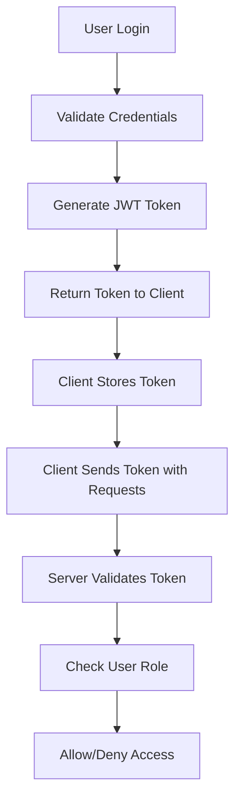

# CYPHER Authentication System Guide

## 🎯 Overview

The CYPHER application uses a **simple, efficient role-based authentication system** that provides robust security without the complexity of granular permissions. This system was designed for ease of use, maintenance, and performance.

## 🏗️ System Architecture

### Core Components

1. **JWT Tokens**: Stateless authentication tokens containing user information
2. **Role-Based Authorization**: Simple role checking using user roles
3. **Middleware Functions**: `authenticateToken` and `requireRole`

### Authentication Flow



## 🔐 User Roles

### Role Definitions

| Role | Access Level | Description |
|------|-------------|-------------|
| **admin** | Full CRUD Access | Complete system administration, user management, configuration |
| **user** | Read + Limited Write | View dashboards, update own profile, generate reports |
| **moderator** | Limited Admin | Content moderation, user support (optional) |

### Role Assignment

Users are assigned roles in the database `users` table:

```sql
-- Users table structure
CREATE TABLE users (
  id SERIAL PRIMARY KEY,
  username VARCHAR(255) NOT NULL,
  email VARCHAR(255),
  password VARCHAR(255) NOT NULL,
  role VARCHAR(50) DEFAULT 'user',  -- 'admin', 'user', 'moderator'
  status VARCHAR(50) DEFAULT 'active',
  created_at TIMESTAMP DEFAULT NOW()
);
```

## 🛠️ Implementation

### 1. Authentication Middleware

**File**: `api/src/middleware/auth.js`

```javascript
const jwt = require('jsonwebtoken');
const { db } = require('../db');
const { users } = require('../db/schema');
const { eq } = require('drizzle-orm');

// Authenticate JWT token
const authenticateToken = async (req, res, next) => {
  try {
    const authHeader = req.headers.authorization;
    const token = authHeader && authHeader.split(' ')[1];

    if (!token) {
      return res.status(401).json({
        success: false,
        message: 'Access token is required',
      });
    }

    const decoded = jwt.verify(token, process.env.JWT_SECRET);
    
    // Verify user still exists and is active
    const [user] = await db
      .select({
        id: users.id,
        email: users.email,
        username: users.username,
        role: users.role,
        status: users.status,
      })
      .from(users)
      .where(eq(users.id, decoded.userId));

    if (!user || user.status !== 'active') {
      return res.status(401).json({
        success: false,
        message: 'Invalid or inactive user',
      });
    }

    req.user = user;
    next();
  } catch (error) {
    return res.status(401).json({
      success: false,
      message: 'Invalid token',
    });
  }
};

// Check user role authorization
const requireRole = (allowedRoles) => {
  return (req, res, next) => {
    if (!req.user) {
      return res.status(401).json({
        success: false,
        message: 'Authentication required',
      });
    }

    if (!allowedRoles.includes(req.user.role)) {
      return res.status(403).json({
        success: false,
        message: 'Insufficient permissions',
      });
    }

    next();
  };
};

module.exports = {
  authenticateToken,
  requireRole,
};
```

### 2. Route Protection Patterns

#### Standard CRUD Operations

```javascript
const express = require('express');
const controller = require('../controllers/exampleController');
const { authenticateToken, requireRole } = require('../middleware/auth');

const router = express.Router();

// Apply authentication to all routes
router.use(authenticateToken);

// READ operations - allow admin and user
router.get('/', requireRole(['admin', 'user']), controller.getAll);
router.get('/:id', requireRole(['admin', 'user']), controller.getById);

// WRITE operations - admin only
router.post('/', requireRole(['admin']), controller.create);
router.put('/:id', requireRole(['admin']), controller.update);
router.delete('/:id', requireRole(['admin']), controller.delete);

module.exports = router;
```

#### Mixed Access Patterns

```javascript
// User profile - users can update their own profile
router.put('/profile/:id', requireRole(['admin', 'user']), controller.updateProfile);

// System settings - admin only
router.put('/settings', requireRole(['admin']), controller.updateSettings);

// Reports - both roles can generate
router.post('/reports', requireRole(['admin', 'user']), controller.generateReport);
```

## 🚀 Benefits of This System

### 1. **Simplicity**
- Easy to understand and implement
- No complex permission matrices
- Clear role definitions

### 2. **Performance**
- No database joins for permission checking
- Fast role validation
- Minimal overhead

### 3. **Maintainability**
- Simple to modify and extend
- Clear authorization logic
- Easy debugging

### 4. **Security**
- JWT token validation
- Role-based access control
- Stateless authentication

## 🔄 Migration from RBAC

The CYPHER application previously used a complex Role-Based Access Control (RBAC) system with granular permissions. This was simplified to the current role-based system for the following reasons:

### Why We Migrated

1. **Complexity**: RBAC required multiple database tables and complex queries
2. **Performance**: Permission checking involved database joins
3. **Maintenance**: Difficult to understand and modify
4. **Overkill**: The application didn't need granular permissions

### What Changed

| Before (RBAC) | After (Simple Roles) |
|---------------|---------------------|
| `requirePermission('users:read')` | `requireRole(['admin', 'user'])` |
| `requirePermission('systems:write')` | `requireRole(['admin'])` |
| Complex permission database tables | Simple user role field |
| Database queries for permissions | In-memory role checking |

## 📋 Best Practices

### 1. Route Protection
- **Always** apply `authenticateToken` to protected routes
- Use `requireRole` with appropriate roles for each endpoint
- Group similar access patterns together

### 2. Role Assignment
- Default new users to `user` role
- Only assign `admin` role to trusted users
- Consider `moderator` role for limited admin access

### 3. Token Management
- Use secure JWT secrets
- Implement token expiration (15 minutes for access tokens)
- Use refresh tokens for extended sessions

### 4. Error Handling
- Return consistent error messages
- Don't expose sensitive information in errors
- Log authentication failures for security monitoring

## 🔍 Troubleshooting

### Common Issues

**1. Token Expired**
```
Error: Token expired
Solution: Implement token refresh mechanism
```

**2. Invalid Role**
```
Error: Insufficient permissions
Solution: Check user role assignment in database
```

**3. Missing Authentication**
```
Error: Access token is required
Solution: Ensure client sends Authorization header
```

### Debug Tips

1. **Check Token**: Verify JWT token is valid and not expired
2. **Verify Role**: Confirm user has correct role in database
3. **Test Middleware**: Ensure middleware is applied to routes
4. **Check Headers**: Verify Authorization header format

## 📚 Related Documentation

- **[API Development Guide](../API_DOCUMENTATION/API_DEVELOPMENT_GUIDE.md)**: Complete API development patterns
- **[Development Patterns Guide](./DEVELOPMENT_PATTERNS_GUIDE.md)**: Backend and frontend patterns
- **[Debugging Guide](./DEBUGGING_GUIDE.md)**: Troubleshooting authentication issues

---

**Last Updated**: December 2024  
**System Version**: CYPHER v2.0 (Post-RBAC Migration)
