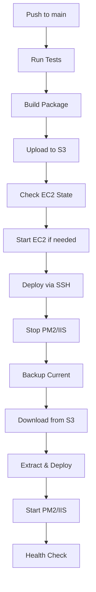

# Windows EC2 Deployment Guide for CYPHER

## 🎯 **Overview**

This guide explains how to set up and deploy the CYPHER application to AWS Windows Server 2019 EC2 instance using GitLab CI/CD pipeline.

## 🏗️ **Prerequisites**

### **AWS Resources Required:**
- Windows Server 2019 EC2 instance (i-04a41343a3f51559a)
- S3 bucket for deployment artifacts (rasdash-deployments)
- IAM role with appropriate permissions
- Security group allowing HTTP/HTTPS and RDP access

### **GitLab CI/CD Variables Required:**
```bash
# AWS Credentials
AWS_ACCESS_KEY_ID=your-aws-access-key
AWS_SECRET_ACCESS_KEY=your-aws-secret-key

# EC2 SSH Access
EC2_PRIVATE_KEY=your-ec2-private-key-content

# Database Configuration
DB_HOST=your-database-host
DB_PORT=5432
DB_NAME=your-database-name
DB_USER=your-database-user
DB_PASSWORD=your-database-password

# Application Secrets
JWT_SECRET=your-jwt-secret
OPENAI_API_KEY=your-openai-key
ANTHROPIC_API_KEY=your-anthropic-key
NVD_API_KEY=your-nvd-key
MAILERSEND_API_KEY=your-mailersend-key

# Email Configuration
EMAIL_FROM=noreply@your-domain.com
```

## 🖥️ **Windows Server Setup**

### **1. Initial Server Configuration**

Connect to your Windows EC2 instance via RDP and run these PowerShell commands as Administrator:

```powershell
# Enable PowerShell execution
Set-ExecutionPolicy -ExecutionPolicy RemoteSigned -Force

# Install Chocolatey package manager
Set-ExecutionPolicy Bypass -Scope Process -Force
[System.Net.ServicePointManager]::SecurityProtocol = [System.Net.ServicePointManager]::SecurityProtocol -bor 3072
iex ((New-Object System.Net.WebClient).DownloadString('https://community.chocolatey.org/install.ps1'))

# Install required software
choco install nodejs --version=18.17.0 -y
choco install git -y
choco install awscli -y
choco install openssh -y

# Install PM2 globally
npm install -g pm2
npm install -g pm2-windows-service

# Install PM2 as Windows service
pm2-service-install -n PM2

# Create deployment directories
New-Item -ItemType Directory -Force -Path "C:\deployments\logs"
New-Item -ItemType Directory -Force -Path "C:\deployments\backups"
New-Item -ItemType Directory -Force -Path "C:\deployments\temp"
New-Item -ItemType Directory -Force -Path "C:\inetpub\wwwroot\cypher"
```

### **2. IIS Configuration**

```powershell
# Enable IIS and required features
Enable-WindowsOptionalFeature -Online -FeatureName IIS-WebServerRole, IIS-WebServer, IIS-CommonHttpFeatures, IIS-HttpErrors, IIS-HttpLogging, IIS-RequestFiltering, IIS-StaticContent, IIS-DefaultDocument, IIS-DirectoryBrowsing

# Install URL Rewrite module (download from Microsoft)
# https://www.iis.net/downloads/microsoft/url-rewrite

# Create IIS site for CYPHER
Import-Module WebAdministration
New-Website -Name "CYPHER" -Port 80 -PhysicalPath "C:\inetpub\wwwroot\cypher\client"

# Create web.config for client routing
$webConfig = @"
<?xml version="1.0" encoding="UTF-8"?>
<configuration>
  <system.webServer>
    <rewrite>
      <rules>
        <rule name="React Routes" stopProcessing="true">
          <match url=".*" />
          <conditions logicalGrouping="MatchAll">
            <add input="{REQUEST_FILENAME}" matchType="IsFile" negate="true" />
            <add input="{REQUEST_FILENAME}" matchType="IsDirectory" negate="true" />
            <add input="{REQUEST_URI}" pattern="^/(api)" negate="true" />
          </conditions>
          <action type="Rewrite" url="/" />
        </rule>
      </rules>
    </rewrite>
    <staticContent>
      <mimeMap fileExtension=".json" mimeType="application/json" />
      <mimeMap fileExtension=".js" mimeType="application/javascript" />
    </staticContent>
  </system.webServer>
</configuration>
"@

$webConfig | Out-File -FilePath "C:\inetpub\wwwroot\cypher\client\web.config" -Encoding UTF8
```

### **3. Configure SSH Access**

```powershell
# Start SSH service
Start-Service sshd
Set-Service -Name sshd -StartupType 'Automatic'

# Configure SSH for GitLab CI/CD
# Add your GitLab runner's public key to authorized_keys
$sshDir = "C:\Users\Administrator\.ssh"
New-Item -ItemType Directory -Force -Path $sshDir

# Add your public key to authorized_keys file
# You'll need to add the public key corresponding to EC2_PRIVATE_KEY
```

## 🚀 **GitLab CI/CD Pipeline**

### **Pipeline Stages:**

1. **Test** - Runs API tests and builds client
2. **Build** - Creates deployment package
3. **Deploy** - Deploys to Windows EC2 with IIS and PM2
4. **Health Check** - Verifies deployment success

### **Key Features:**

- **Automatic EC2 startup** if instance is stopped
- **S3 artifact storage** with timestamped releases
- **Zero-downtime deployment** with backup creation
- **PM2 process management** for API
- **IIS hosting** for client
- **Comprehensive health checks**

### **Deployment Flow:**



## 🔧 **Manual Deployment Commands**

### **Deploy Latest Release:**

```powershell
# Download and deploy latest release
$TempPath = "C:\deployments\temp"
$AppPath = "C:\inetpub\wwwroot\cypher"

# Download from S3
aws s3 cp s3://rasdash-deployments/CYPHER-DEPLOYMENT/latest/cypher-latest.zip $TempPath\cypher-latest.zip

# Stop services
pm2 stop cypher-api
iisreset /stop

# Backup current deployment
$BackupPath = "C:\deployments\backups\$(Get-Date -Format 'yyyyMMdd-HHmmss')"
Copy-Item -Path $AppPath -Destination $BackupPath -Recurse -Force

# Extract and deploy
Expand-Archive -Path $TempPath\cypher-latest.zip -DestinationPath $TempPath\extracted -Force
Remove-Item -Path $AppPath\* -Recurse -Force
Copy-Item -Path $TempPath\extracted\* -Destination $AppPath -Recurse -Force

# Install dependencies and start services
Set-Location $AppPath\api
npm install --production
Set-Location $AppPath
pm2 start ecosystem.config.js
iisreset /start
```

### **Rollback to Previous Version:**

```powershell
# List available backups
Get-ChildItem "C:\deployments\backups" | Sort-Object Name -Descending

# Rollback to specific backup
$BackupToRestore = "C:\deployments\backups\20241205-143022"  # Replace with actual backup
$AppPath = "C:\inetpub\wwwroot\cypher"

# Stop services
pm2 stop cypher-api
iisreset /stop

# Restore backup
Remove-Item -Path $AppPath\* -Recurse -Force
Copy-Item -Path $BackupToRestore\* -Destination $AppPath -Recurse -Force

# Start services
Set-Location $AppPath
pm2 start ecosystem.config.js
iisreset /start
```

## 🔍 **Monitoring & Troubleshooting**

### **Check Service Status:**

```powershell
# Check PM2 processes
pm2 status
pm2 logs cypher-api

# Check IIS status
Get-Service W3SVC
Get-Website

# Check application logs
Get-Content "C:\deployments\logs\api-combined.log" -Tail 50
```

### **Common Issues:**

1. **PM2 not starting:**
   ```powershell
   pm2 kill
   pm2 start ecosystem.config.js
   ```

2. **IIS not serving files:**
   ```powershell
   iisreset /restart
   # Check web.config syntax
   ```

3. **Database connection issues:**
   ```powershell
   # Check .env file in api directory
   Get-Content "C:\inetpub\wwwroot\cypher\api\.env"
   ```

## 🔒 **Security Considerations**

- **Firewall rules** - Only allow necessary ports (80, 443, 3389)
- **Regular updates** - Keep Windows Server updated
- **SSL certificates** - Use HTTPS in production
- **Environment variables** - Store secrets securely
- **Backup strategy** - Regular automated backups

## 📊 **Performance Optimization**

- **PM2 clustering** - Scale API processes as needed
- **IIS compression** - Enable gzip compression
- **Static file caching** - Configure proper cache headers
- **Database optimization** - Use connection pooling

---

**Your CYPHER application is now ready for automated deployment to Windows Server 2019! 🚀**
